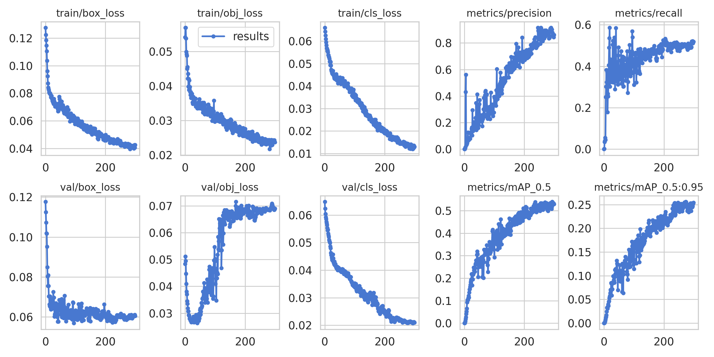

# Water meter reader

# Objective
The goal is to build a water meter reader

# Dataset preparation
[Label Studio](https://labelstud.io/) was used for annotating the readings.

# Training
[Yolov5](https://github.com/ultralytics/yolov5) was used for object detection

I annotated around 400 images, but you could do with less provided you increase the epochs. Initially I only used 50 epochs which was inadequate as the image quality is poor. In the end, I used 300 epochs which took about 2 hours to train.
The mAP@0.5 was around 55%, and the overall accuracy on the validation set was around 65%.

This could be further improved by doing the following:
1) Add more annotated images
2) Include the rotation angle of the bounding boxes
3) Train for > 300 epochs

# Results

# App
I built an app using [Streamlit](https://docs.streamlit.io/library/api-reference)
You can access it [here](https://share.streamlit.io/sl2902/kaggle/main/covid19/streamlit_app.py)

